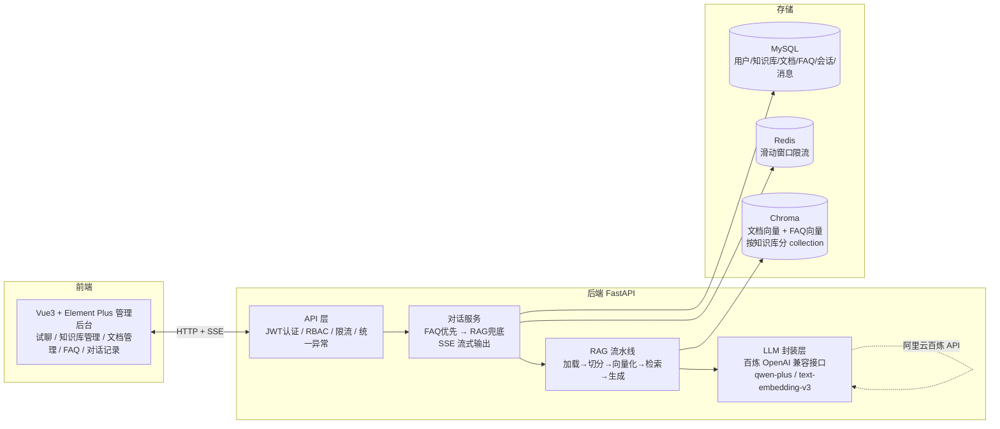

# 智能客服问答系统

基于 **LangChain + FastAPI + Vue3** 的企业级智能客服系统，支持多轮对话、RAG 知识库问答、FAQ 自动回复，Docker Compose 一键部署。

> 本项目使用 VSCode + Claude Code（DeepSeek）AI 辅助开发，从需求梳理到部署全程 AI 协作完成。

## ✨ 功能特性


| 功能              | 说明                                                                                               |
| ----------------- | -------------------------------------------------------------------------------------------------- |
| 📚 RAG 知识库问答 | 上传 PDF/Word 自动切分向量化，提问时检索相关内容生成回答，附来源引用（文件名+页码+相似度）         |
| ⚡ FAQ 自动回复   | 提问与 FAQ 问题向量相似度 ≥ 阈值时直接返回预设答案：**零 token 成本、毫秒级响应、答案 100% 可控** |
| 💬 多轮对话       | 会话管理 + 历史窗口拼接，上下文连贯                                                                |
| 📡 流式输出       | SSE 逐字推送回答，nginx 层禁用缓冲保障真流式                                                       |
| 🔒 认证鉴权       | JWT 认证 + RBAC 角色控制（管理员/访客），开放注册（注册即登录，服务端强制普通用户角色）        |
| 🗂 多知识库       | 多知识库管理，向量数据按知识库隔离（独立 collection）                                              |
| 🔄 异步文档处理   | 上传即返回，后台处理，状态机流转（pending→processing→succeeded/failed），失败可重试              |
| 🚦 限流保护       | Redis 滑动窗口限流，Redis 故障自动降级放行                                                         |
| 📊 管理后台       | 统计面板、文档/FAQ 管理、全量对话记录查询（合规追溯）                                              |
| 🚀 一键部署       | Docker Compose 编排 MySQL + Redis + 后端 + 前端                                                    |

## 🏗 系统架构



### 核心流程：FAQ 优先 + RAG 兜底

```
用户提问
   │
   ▼
限流检查（Redis 滑动窗口）────────── 超限 → 429 提示
   │
   ▼
FAQ 向量匹配（question vs FAQ 问题向量）
   │
   ├─ 相似度 ≥ 0.85：直接返回预设答案（match_type=faq）
   │
   └─ 未命中：RAG 检索知识库 → LLM 流式生成（match_type=rag，附引用来源）
```

## 🛠 技术栈


| 层       | 技术                                        | 选型理由                                                            |
| -------- | ------------------------------------------- | ------------------------------------------------------------------- |
| 后端框架 | FastAPI + Pydantic v2                       | 异步高性能、自动 OpenAPI 文档、类型安全                             |
| AI 框架  | LangChain 1.x                               | 文档加载/切分/向量库/链式编排生态成熟                               |
| 大模型   | 阿里云百炼（qwen-plus + text-embedding-v3） | OpenAI 兼容接口调用，封装层解耦厂商                                 |
| 向量库   | Chroma                                      | 嵌入式部署零运维；十万级片段性能足够；存储层已抽象可平滑迁移 Milvus |
| 数据库   | MySQL 8 + SQLAlchemy 2.x + Alembic          | 业务数据关系型存储，迁移版本化管理                                  |
| 缓存     | Redis 7                                     | 滑动窗口限流                                                        |
| 前端     | Vue3 + Vite + Element Plus + Pinia          | 组件化开发效率高，生态完善                                          |
| 部署     | Docker Compose                              | 四服务一键编排，数据卷落项目目录                                    |

## 🚀 快速开始

### 前置条件

- Docker + Docker Compose
- 阿里云百炼 API Key（[申请地址](https://bailian.console.aliyun.com/)）

### 一键部署

```bash
# 1. 配置环境变量
cp .env.example .env
# 编辑 .env，填入 DASHSCOPE_API_KEY

# 2. 构建并启动（首次构建需下载镜像，约 3-5 分钟）
docker compose up -d --build

# 3. 访问系统
# 前端：http://localhost
# 后端 API 文档：http://localhost:8000/api/docs
# 默认管理员：admin / admin123（.env 中 ADMIN_USERNAME/ADMIN_PASSWORD 配置）
```

### 使用流程

1. 管理员登录 → 「知识库管理」新建知识库（如：售后政策库）
2. 「文档管理」上传 PDF/Word → 等待状态变为「已完成」
3. 「FAQ 管理」录入常见问题（可选）
4. 「智能试聊」选择知识库开始提问：FAQ 命中直接回复，未命中走 RAG 并展示引用来源

### 停止 / 清理

```bash
docker compose down          # 停止（保留数据）
docker compose down -v       # 停止并清空数据卷
```

## 🧪 本地开发

```bash
# 后端（backend 目录）
python -m venv .venv
.venv/Scripts/pip install -r requirements.txt
.venv/Scripts/python -m uvicorn app.main:app --reload --port 8000

# 前端（frontend 目录，另开终端）
npm install
npm run dev                  # http://localhost:5173（已配置 /api 代理）

# 运行测试（backend 目录）
.venv/Scripts/python -m pytest tests/ -v
```

## 📁 项目结构

```
project1/
├── backend/                    # FastAPI 后端
│   ├── app/
│   │   ├── api/                # 路由层（auth/kb/documents/faqs/chat/admin/health）
│   │   ├── core/               # 日志、统一异常、JWT、限流、请求ID中间件
│   │   ├── llm/                # 百炼封装（对话模型 + 自定义 Embeddings）
│   │   ├── rag/                # RAG 流水线（加载/切分/向量库/检索生成）
│   │   ├── models/             # SQLAlchemy ORM
│   │   ├── schemas/            # Pydantic 契约
│   │   └── services/           # 业务逻辑（文档状态机/FAQ一致性/对话流程）
│   ├── alembic/                # 数据库迁移
│   ├── tests/                  # pytest（16 个用例覆盖核心流程）
│   └── scripts/rag_demo.py     # RAG 流水线验证脚本
├── frontend/                   # Vue3 管理后台
│   └── src/
│       ├── views/              # 登录/试聊/知识库/文档/FAQ/记录/统计
│       ├── api/                # Axios 封装 + 接口定义
│       ├── utils/sse.js        # SSE 流式解析（fetch + ReadableStream）
│       ├── stores/             # Pinia 状态
│       └── router/             # 路由 + 守卫
├── docker-compose.yml          # 四服务编排
└── .env.example                # 环境变量模板
```
